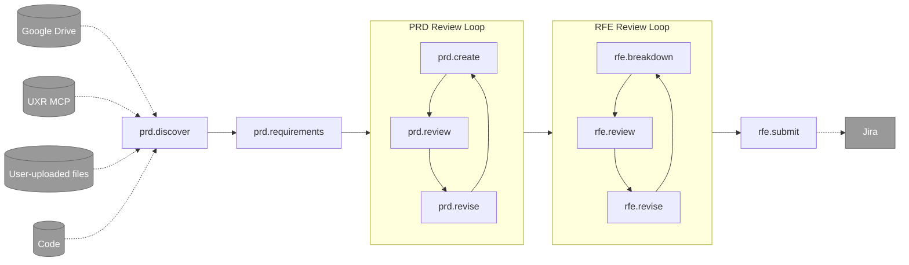

# PRD & RFE Creation Workflow for Ambient Code Platform

A comprehensive workflow for creating Product Requirements Documents (PRDs) and systematically breaking them down into actionable Request for Enhancement (RFE) items. 

## Who this is for

**Product Managers** who want to leverage agents in the creation of comprehensive, well-defined, data-informed PRDs and RFEs. The goal is to generate PRDs and RFEs that are more likely to be accepted by a Senior Engineer or Architect for implementation.

## Workflow

The creation of a PRD and subsequent refinements of RFEs associated with that PRD follow a general workflow that starts with discovery, goes through two refinement loops, and utimately exports RFE definitions to Jira. The workflow is accessible through commands (ex. prd.create) which enable the user to keep the agents on track. Some commands have prerequisites. For example `/rfe.breakdown` which breaks a PRD down into RFEs, requires the existance of a PRD document. 



## Workflow Steps & Agent Collaborators

### 1. `prd.discover` - Product Discovery
**Purpose**: Understand the problem space, user needs, and market opportunity. Coordinate with adjacent products that may exist or are in development.

**Data Connections**:
- **Google Drive** - Access to user's product documents, stakeholder notes, and related assets.
- **UXR MCP** - Aggregates and provides structured access to all available user research reports, findings, and actionable insights relevant to the problem space.
- **User-uploaded files** - Allows team members to directly upload supporting materials.
- **Code** - Access to relevant code repositories.

**Collaborating Agents**:
- **@parker-product_manager.md** - Market strategy, competitive analysis, opportunity quantification
- **@ryan-ux_researcher.md** - User insights from research studies, evidence-based requirements (CRITICAL: grounds requirements in available research from "All UXR Reports" folder)
- **@aria-ux_architect.md** (bullpen) - User journey mapping, ecosystem-level UX strategy

**Key Actions**:
- Define problem statement and business goals
- Collect source materials such as notes and links to related code repositories
- Research user pain points with data from existing studies
- Analyze competitive landscape and market opportunity
- Document assumptions and success metrics

---

### 2. `prd.requirements` - Requirements Gathering
**Purpose**: Gather and document detailed product requirements based on discovery findings

**Collaborating Agents**:
- **@parker-product_manager.md** - Business requirements, success criteria, constraints, and prioritization
- **@ryan-ux_researcher.md** - User requirements grounded in research studies, user stories with evidence
- **@olivia-product_owner.md** (bullpen) - User story structure, acceptance criteria definition, requirement prioritization (MoSCoW)
- **@aria-ux_architect.md** (bullpen) - User flows, information architecture considerations

**Key Actions**:
- Transform discovery insights into specific, testable requirements
- Write user stories with clear acceptance criteria
- Define functional and non-functional requirements
- Prioritize requirements using MoSCoW method
- Document constraints, dependencies, and assumptions
- Clearly define scope and out-of-scope items

---

### 3. `prd.create` - PRD Creation
**Purpose**: Create a comprehensive Product Requirements Document

**Collaborating Agents**:
- **@parker-product_manager.md** - Business requirements, value proposition, ROI justification
- **@ryan-ux_researcher.md** - Research-informed requirements with citations from studies
- **@terry-technical_writer.md** - Documentation quality, clarity, and structure
- **@casey-content_strategist.md** (bullpen) - Content architecture and standards

**Key Actions**:
- Write executive summary and product vision
- Document goals, success metrics, and KPIs
- Define user stories with research backing
- Specify functional and non-functional requirements

---

### 4. `prd.review` - PRD Review
**Purpose**: Review PRD for quality, completeness, and feasibility; determine if prototyping is needed

**Collaborating Agents**:
- **@steve-ux_designer.md** - UX assessment, determine if prototype needed for validation
- **@aria-ux_architect.md** (bullpen) - Holistic UX strategy validation, journey alignment
- **@olivia-product_owner.md** (bullpen) - Story readiness, acceptance criteria validation
- **@archie-architect.md** (bullpen) - Technical feasibility, architecture alignment

**Key Actions**:
- Validate requirements are clear and testable
- Assess if prototype is needed for user validation
- Check technical feasibility and architecture fit
- Ensure documentation meets quality standards

---

### 5. `prd.revise` - PRD Revision
**Purpose**: Revise PRD based on review feedback

**Collaborating Agents**:
- **@parker-product_manager.md** - Business value adjustments, strategic refinements
- **@terry-technical_writer.md** - Clarity improvements, documentation structure

**Key Actions**:
- Address review feedback and gaps
- Strengthen requirements with additional research
- Improve clarity and structure
- Validate all acceptance criteria are testable

---

### 6. `rfe.breakdown` - RFE Breakdown
**Purpose**: Break down PRD into actionable Request for Enhancement items

**Collaborating Agents**:
- **@olivia-product_owner.md** (bullpen) - Backlog management, story decomposition, acceptance criteria
- **@stella-staff_engineer.md** - Technical scoping, effort estimation, complexity assessment
- **@archie-architect.md** (bullpen) - System design, dependencies, architectural coordination
- **@neil-test_engineer.md** (bullpen) - Testability assessment, automation requirements, cross-component impact

**Key Actions**:
- Decompose PRD into implementable RFEs
- Define clear acceptance criteria for each RFE
- Identify technical dependencies and risks
- Size RFEs and assess testing requirements

---

### 7. `rfe.review` - RFE Review
**Purpose**: Review RFEs for technical feasibility, testability, and team capacity

**Collaborating Agents**:
- **@stella-staff_engineer.md** - Technical feasibility, implementation complexity, risk assessment
- **@archie-architect.md** (bullpen) - Architecture alignment, system-level implications
- **@neil-test_engineer.md** (bullpen) - Testing requirements, automation strategy, cross-team impact
- **@emma-engineering_manager.md** (bullpen) - Team capacity planning, delivery coordination
- **@olivia-product_owner.md** (bullpen) - Acceptance criteria validation, scope negotiation

**Key Actions**:
- Validate technical approach and feasibility
- Assess testability and automation requirements
- Check team capacity and delivery timeline
- Ensure architecture alignment

---

### 8. `rfe.revise` - RFE Revision
**Purpose**: Revise RFEs based on technical and capacity feedback

**Collaborating Agents**:
- **@olivia-product_owner.md** (bullpen) - Story refinement, scope adjustments
- **@stella-staff_engineer.md** - Technical design adjustments, complexity reduction
- **@neil-test_engineer.md** (bullpen) - Test requirements clarification, testability improvements

**Key Actions**:
- Address technical concerns and risks
- Refine acceptance criteria for clarity
- Adjust scope based on capacity constraints
- Enhance testability of requirements

---

### 9. `rfe.submit` - RFE Submission
**Purpose**: Submit approved RFEs to Jira for implementation planning and team assignment

**Data Connections**:
- **Jira MCP** - When available, automatically creates Jira tickets from RFE files with proper field mapping, dependencies, and attachments

**Collaborating Agents**:
- **@olivia-product_owner.md** (bullpen) - Backlog prioritization, sprint planning, ticket structure
- **@emma-engineering_manager.md** (bullpen) - Team assignment, capacity allocation, delivery coordination
- **@parker-product_manager.md** - Roadmap alignment, stakeholder communication

**Key Actions**:
- **If Jira MCP available**: Automatically create Jira tickets from RFE files
  - Map RFE fields to Jira fields (title, description, priority, acceptance criteria)
  - Link dependent tickets
  - Attach RFE markdown files
  - Create ticket mapping document
- **If Jira MCP not available**: Provide manual submission instructions
  - Direct users to `artifacts/rfe-tasks/` directory
  - Provide step-by-step instructions for creating tickets
  - Include field mapping guidance
- Prioritize RFEs in backlog
- Assign to appropriate teams
- Align with product roadmap

---

## Artifacts Generated

All workflow artifacts are organized in the `artifacts/` directory:

```
artifacts/
├── discovery.md                  # Product discovery document
├── requirements.md               # Detailed requirements
├── prd.md                        # Product Requirements Document
├── prd-checklist.md              # PRD quality checklist
├── rfes.md                       # RFE master list
├── rfe-tasks/                    # Individual RFE documents
│   ├── RFE-001-feature-name.md
│   ├── RFE-002-feature-name.md
│   └── ...
├── prioritization.md             # Prioritization and roadmap (optional)
├── roadmap-visual.md             # Visual roadmap (optional)
├── review-report.md              # Quality review report
└── jira-tickets.md               # Jira ticket mapping (created by rfe.submit)
```

## Getting Started

### Quick Start

1. **Create an AgenticSession** in the Ambient Code Platform
2. **Select "PRD & RFE Creation"** from the workflows dropdown
3. **Start with `/prd.discover`** to begin product discovery
4. **Follow the phases** sequentially or jump to any phase based on your context

### Example Usage

**Scenario 1: New product idea**
```
User: "We want to add a user analytics dashboard to help users track their usage patterns"

Workflow: /prd.discover to understand the problem and opportunity
→ /prd.requirements to gather detailed requirements
→ /prd.create to generate comprehensive PRD
→ /rfe.breakdown to create implementable RFEs
→ /rfe.prioritize to plan implementation roadmap
→ /review to validate quality
```

**Scenario 2: You already have requirements**
```
User: "I have detailed requirements for a new reporting feature"

Workflow: Jump to /prd.create to generate PRD
→ /rfe.breakdown to create RFEs
→ /rfe.prioritize to plan roadmap
→ /review to validate
```

**Scenario 3: You have a PRD and need RFEs**
```
User: "I have a complete PRD for our mobile app redesign and need to break it into RFEs"

Workflow: Jump to /rfe.breakdown to decompose into RFEs
→ /rfe.prioritize to plan implementation
→ /review to validate coverage
```

### Prerequisites

- Clear understanding of the problem or product opportunity
- Access to user research, market data, or competitive analysis (helpful but not required)
- Stakeholder alignment on business goals and success metrics
- Understanding of technical constraints and dependencies (for RFE breakdown)

## Agent Orchestration

Agent collaboration is automatically triggered when you use the workflow commands—specialized agents are orchestrated as needed to ensure high-quality product documentation. Additionally, you can bring any individual agent into a conversation at any point by typing the '@' symbol and selecting an agent by name.


## Customization

### For Your Organization

You can customize this workflow by:

1. **Customizing PRD template** in `/prd.create` to match your org's format
2. **Adding custom prioritization methods** in `/rfe.prioritize`
3. **Modifying RFE sizing criteria** to match your team's velocity
4. **Adding company-specific agents** for domain expertise
5. **Extending phases** with additional validation steps
6. **Customizing artifact paths** to match your document management system

### Industry-Specific Adjustments

Adjust the workflow for different industries:

- **SaaS**: Add subscription metrics and user onboarding considerations
- **Enterprise**: Include compliance, security, and governance requirements
- **Mobile Apps**: Add app store requirements and device compatibility
- **Healthcare**: Include HIPAA and regulatory compliance
- **Financial Services**: Add security, audit, and compliance sections

## Integration with ACP

This workflow integrates seamlessly with the Ambient Code Platform:

- **Workflow Selection**: Choose "PRD & RFE Creation" when creating AgenticSession
- **Artifact Management**: All outputs saved to `artifacts/` directory
- **Agent Invocation**: Automatically suggests agents based on phase and complexity
- **Progressive Disclosure**: Jump to any phase based on your context
- **Version Control**: All artifacts are plain markdown for easy versioning

## Contributing

Found issues with the workflow or have improvements?

- **Report issues**: [ambient-workflows issues](https://github.com/ambient-code/ambient-workflows/issues)
- **Suggest improvements**: Create a PR with your enhancements
- **Share learnings**: Document what worked well for your team

## License

This workflow is part of the Ambient Code Platform Workflows collection.

## Support

- **Documentation**: See [Ambient Code Platform docs](https://ambient-code.github.io/platform/)
- **Issues**: [File a bug](https://github.com/ambient-code/ambient-workflows/issues)
- **Questions**: Ask in the ACP community channels

---

**Happy Product Planning! 📋→🚀**
