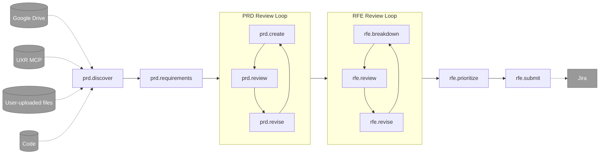

```mermaid
flowchart LR
    GD[(Google Drive)] -.-> A
    UXR[(UXR MCP)] -.-> A
    UF[(User-uploaded files)] -.-> A
    CODE[(Code)] -.-> A
    
    A[prd.discover] --> REQ[prd.requirements]
    REQ --> review_loop
    
    subgraph review_loop["PRD Review Loop"]
        B[prd.create] --> C[prd.review]
        C --> D[prd.revise]
        D --> B
    end
    
    subgraph rfe_loop["RFE Review Loop"]
        E[rfe.breakdown] --> F[rfe.review]
        F --> G[rfe.revise]
        G --> E
    end
    
    review_loop --> rfe_loop
    rfe_loop --> PRIO[rfe.prioritize]
    PRIO --> H[rfe.submit]
    H -.-> JIRA[Jira]
    
    style GD fill:#999,stroke:#666,color:#fff
    style UXR fill:#999,stroke:#666,color:#fff
    style UF fill:#999,stroke:#666,color:#fff
    style CODE fill:#999,stroke:#666,color:#fff
    style JIRA fill:#999,stroke:#666,color:#fff
```

