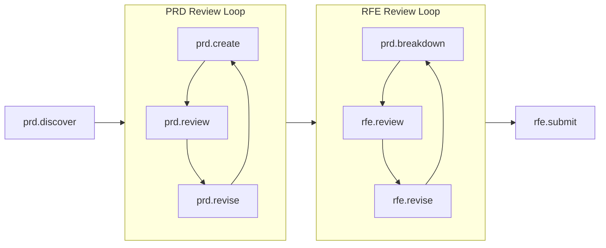

```mermaid
flowchart LR
    A[prd.discover] --> review_loop
    
    subgraph review_loop["PRD Review Loop"]
        B[prd.create] --> C[prd.review]
        C --> D[prd.revise]
        D --> B
    end
    
    subgraph rfe_loop["RFE Review Loop"]
        E[prd.breakdown] --> F[rfe.review]
        F --> G[rfe.revise]
        G --> E
    end
    
    review_loop --> rfe_loop
    rfe_loop --> H[rfe.submit]
```

